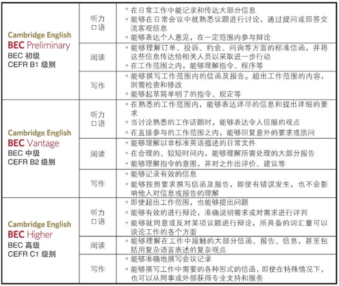
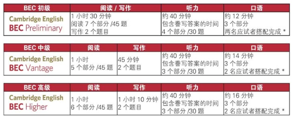

## 剑桥商务英语考试

> 剑桥商务英语证书考试(BEC)是教育部考试中心和英国剑桥大学考试委员会合作，于1993年起举办的考试。该系列考试是一项语言水平考试，根据公务或商务工作的实际需要，对考生在一般工作环境下和商务活动中使用英语的能力从听、说、读、写四个方面进行全面考查，对成绩及格者提供由英国剑桥大学考试委员会颁发的标准统一的成绩证书。考试设有三个级别：初级(BEC Preliminary)、中级(BEC Vantage)和高级(BEC Higher)。分为纸笔考试(阅读、写作和听力)和口语考试(两个考生和两个考官面对面的形式)。目前每年举办两次考试。教育部考试中心海外考试报名信息网独家提供有关报名、考试时间安排、考点分布、考试规定、考试咨询等信息和服务。

### 目录
* 剑桥商务英语证书BEC简介
* 为什么报考
* 考试级别
* BEC考试形式
* 考试费用 支付方式

### 剑桥商务英语证书BEC简介

剑桥商务英语证书BEC是专为职场或即将进入职场的英语学习者所设计的国际商务英语资格证书考试，旨在考查应试者在真实工作环境中的英语交流能力。

自1993 年进入中国以来，BEC的权威性和高含金量使其成为中国影响力最大的职业类英语证书，是“职场英语”、“商务英语”的代名词。

### 为何报考剑桥商务英语证书BEC？

* 两大权威教育考试机构联合推出

    * BEC由剑桥大学英语考评部负责命题、阅卷、颁发证书。中国教育部考试中心于1993年将BEC引进中国，并从此负责其报名、试卷印制等相关考务工作。

    * 教育部考试中心是国家级教育考试主管部门，负责承办各项国家级教育考试并接受教育部委托，承办海外机构在我国举办的各类教育考试，以确保其按照最严谨、最公平的标准开展与执行。

    * 剑桥大学英语考评部隶属于剑桥大学。我们为全球的英语学习者和教师提供一系列顶尖的证书与测评考试。我们拥有百余年语言教学和测评的专业经验，在世界范围内与世界各地的教育部门，政府部门紧密合作，为发展优质的语言教育提供支持。

    * 每年，来自全球130 多个国家的550 万考生为了学习、工作或者出行等不同目的参加我们的考试。全球超过20,000高校、企业雇主和政府机构信赖剑桥英语考试，将其作为在英语环境中生活、工作及学习能力的证明。

* 全面考察听、说、读、写四项技能

    * 剑桥商务英语证书BEC的 考试内容与职场环境密切相关，能准确地反映考生的听、说、读、写四项技能以及英语实际运用能力，为用人单位选拔人才提供客观可靠的参照。

    * BEC 证书持有者具备在国际环境中的英语交流能力，可以在日常工作中发挥语言专长，而不仅仅是具备熟悉固定搭配、英文语法等应试能力。

* 全球认可

    * 剑桥商务英语证书BEC是众多知名跨国企业和国际高等院校评估应聘者和申请人语言能力的标准。在中国，BEC认可机构包括：阿迪达斯、巴斯夫中国、宝洁、壳牌、太古地产、乐购、联邦快递、特斯拉汽车、伊利诺易、沃尔玛、中国铁路工程总公司、中国建筑工程总公司等。

    * 查询国际认可机构列表，请访问官方微信：CambridgeEnglish

* 证书终生有效

    * 考生一旦考取任何级别的剑桥商务英语证书BEC，将拥有一份终身有效的语言成绩证明。无论处在职业发展的任何阶段，剑桥商务英语证书BEC都将祝您一臂之力。 　　

### 考试级别描述

剑桥商务英语证书BEC隶属于剑桥英语证书体系。剑桥英语证书通过无缝衔接的阶段性测评激励学习者一步一个脚印地学习英语，循序渐进地全面提高听、说、读、写四项英语技能。具备丰富英语教学经验的专家们在命题时综合考虑考生们的英语水平、知识结构、心理特点、以及答题习惯等。 剑桥英语证书对英语学习者提供权威性、系统性、阶段性地测评，对英语学习者起到了积极、完整地促进作用。

剑桥商务英语证书BEC分为三个级别：初级、中级、与高级，帮助职场英语学习者一步一个脚印地提高商务英语。每个级别分别描述英语学习者所具备的听、说、读、写四项技能。

### BEC考试形式

*口语部分偶尔会出现3个考生相互搭配完成。该情况仅发生在最后一组考生出现单数时。

### 考试费用 支付方式

2018-2019年度BEC初级考试费为530元人民币/人；BEC中级考试费为660元人民币/人；BEC高级考试费为825元人民币/人。考试费将通过网上支付的形式收取，在支付页面，考生可以选择“支付宝”或“首信易支付”方式支付考试费用。
