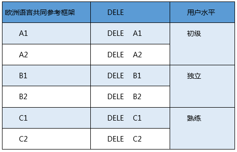

## 对外西班牙语水平证书考试

> 对外西班牙语水平证书（DELE）证书是证明西班牙语能力和掌握水平的官方证书，由塞万提斯学院以西班牙教育文化及体育部的名义颁发，通过DELE考试即可取得证书。考试包括阅读理解、听力理解、书面表达和口语测试。2018年起，DELE考试开始在中国的重庆、大连、广州和哈尔滨举办。

### 目录
* 证书的价值
* 证书的级别
* 考试费用

### 对外西班牙语水平证书(DELE)在中国的价值：
* 是证明作为外语的西班牙语或第二语言各级水平的唯一官方证书
* 是由塞万提斯学院以西班牙教育科学部的名义颁发的证书
* 在国际上已经获得诸多企业、商会、公立及私立教育机构的承认
* 足以证明在西班牙开展有语言能力要求的各项职业或学术工作所要求的语言水平
* 有助于申请西班牙外交部国际合作署的各项奖学金
* 一经通过，终生有效　　
* DELE证书被国际上各大公立及私立学校、国际合作机构、西班牙企业联合会（CEOE）、贸易协会、官方语言学校（EOI）、基金会、公司和其他企业等所承认。DELE A2及以上水平是对于非西班牙语母者申请者，包括来自或者居住在西班牙的塞法尔迪人，取得西班牙国籍的要求。DELE C1或C2对于想要参加西班牙保健、社会服务及平等部组织的医疗培训的非西班牙语母语者的强制要求。另外，DELE证书也是取得来自重要的高校、国际合作组织以及基金会所提 供的奖项、帮助和奖学金所需要的。　　

### DELE证书的级别

与欧洲语言共同参考标准对照，DELE 考试分为八个级别，分别是：

* 青少年DELE A1
    * 面向11至17岁的学生。证明拥有者的语言水平足以应对简单的交流、即时性需要和日常性的话题。
* 青少年 DELE A2/B1
    * 面向11至17岁的考生。通过参加其中一项水平考试，考生即有可能获得青少年DELE B1或DELE A2的水平证书。
* DELE A1
    * 证明拥有者的语言水平足以应对简单的交流、即时性需要和非常日常性的话题。
* DELE A2
    * 证明拥有者能够理解日常表达和其所涉及领域相关的习惯用法，尤其是一些与自身相关的基本信息，比如自己、家庭、购物、景点、职业等等。
* DELE B1
    * 证明拥有者的语言水平足以理解日常生活的基本场景并做出恰当的反应，能够用基础的方式表达愿望和需求。
* DELE B2
    * 证明拥有者的语言水平足以应付日常生活的基本场景，能够应付没有特别专业词汇要求的普通交流环境。
* DELE C1
    * 证书拥有者的语言水平足以无阻碍的清晰表达其所思所想，拥有广泛的词汇量包括文学词汇及口语词汇，并且能够熟练运用。
* DELE C2
    * 证明拥有者的语言水平足以应付较高语言要求的场景，并且熟知语言背后蕴藏的文化。

### 考试费用

级别 | 收费标准(RMB)
---|---
DELE A1 | 660
DELE A2 | 770
DELE B1 | 860
DELE B2 | 1100
DELE C1 | 1190
DELE C2 | 1320