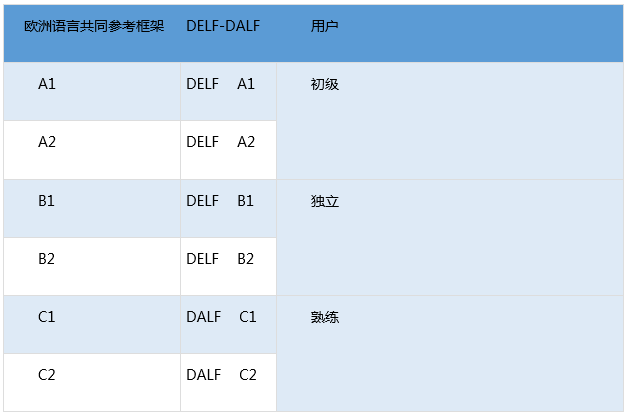
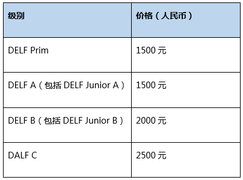

## 法语能力考试

> DELF和DALF是法国教育部颁发的官方文凭，用以证明外国考生或非法语国家中未获得法国中学或大学文凭的法国考生的法语能力。其中，DELF文凭包括四个独立的文凭 (A1, A2, B1, B2)，分别对应欧洲语言共同参考框架 (CECRL) 中的前四个级别；DALF文凭包括两个独立的文凭(C1, C2)，分别对应欧洲语言共同参考框架(CECRL)中的两个最高级别。

根据2008年1月18日法令，获得DELF B2级文凭可免除法国大学入学语言测试；而获得DALF文凭的外国学生在申请法国大学时亦可免除其它法语水平测试。

一般而言，申请法国公立大学本科须提供DELF B2文凭，申请研究生则须具备C1水平。DELF和DALF是法国教育部制定的法语考试标准，没有这两个文凭，可能会影响留学生进入法国的高等院校，尤其是公立大学。DELF和DALF文凭终生有效。

### 目录
* 不同年龄段不同的考试

### 不同年龄段的考生可以注册与其年龄相对应的考试

* DELF Prim(少儿版)面向所有7-12岁的法语初学者；
* DELF Junior(青少年版)面向所有12-17岁的考生；
* DELF-DALF Tout public (成人版)面向所有18岁以上的考生(即上文所介绍)。

每一级别的考试都主要考察以下四种能力：听力理解、口语表达、阅读理解和书面表达。DELF A1、DELF A2、DELF B1、DELF B2和DALF C1对4种语言能力分别评估，而DALF C2 中表达能力和理解能力相关联，表达取决于考生对考试材料的理解。考试材料涉及两个领域：人文科学和理工科学，考生可任选其一。

### 考试收费标准

DELF-DALF在中国的首次考试于2013年6月在北京语言大学正式举办。目前，北京、上海和天津等9座城市设有DELF-DALF考场。从2018年5月和6月考试起，考试的收费标准为：

### 关于DELF-DALF的更多信息, 请访问：

http://www.ciep.fr/delfdalf/index.php                                           

http://exam.blcu.edu.cn/art/2015/4/13/art_8470_1102870.html