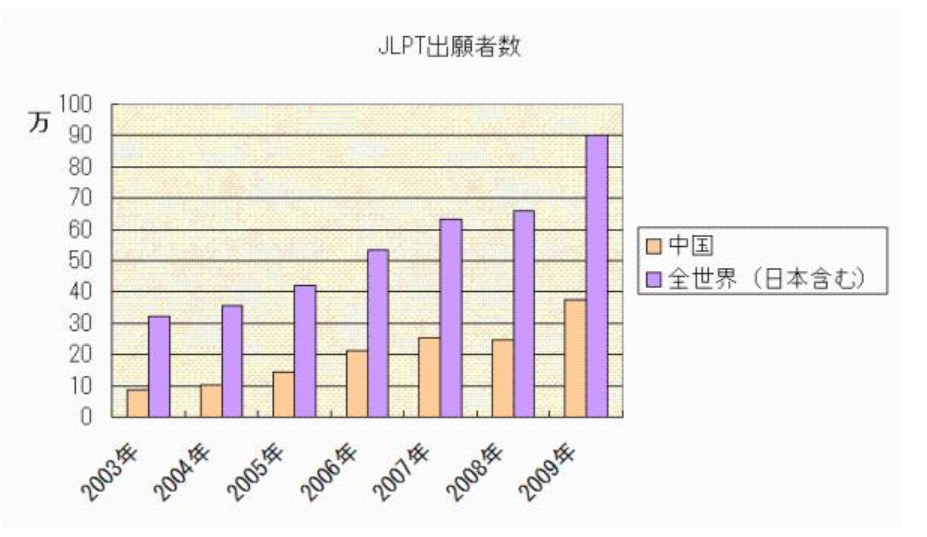
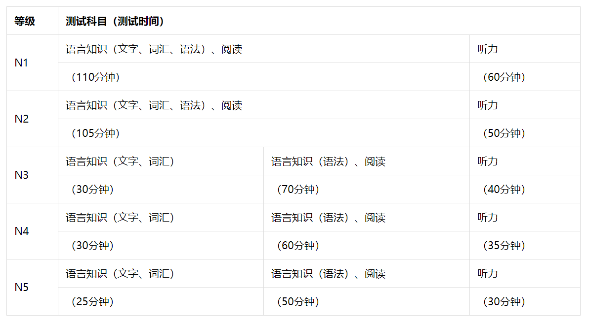
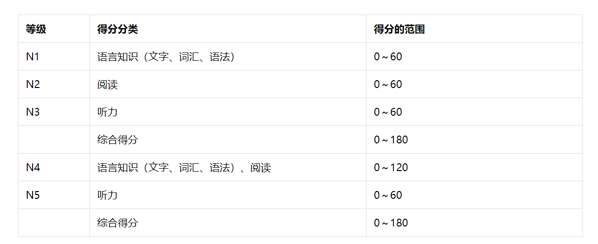

## 日本语能力测试

日本语能力测试（JLPT／The Japanese-Language Proficiency Test）是对日本国内及海外以母语非日语学习者为对象，进行日语能力测试和认定。2009年全世界报名测试的人数达90万人。

此项测试在日本国内由日本语国际教育支援协会举办，在中国由日本国际交流基金会与中国教育部海外考试中心共同协力举办。

此项测试是由日本国际交流基金会及日本国际教育支援协会于1984年建立的一套较为完整的考试评价体系，并于同年开始在有关国家和地区实施，2009年，世界上共有54个国家和地区的176个城市(除日本国内之外)举办此项考试，74.2万人报名。该考試在日本国内由考试实施委员会，决定其方针、实施计划、考试内容及证书的授予标准等。该委员会下设规划委员会和考试委员会。规划委员会负责实施计划的制定和考试结果的分析评价；考试委员会负责试题的命制。

在我国由教育部考试中心负责组织和实施。截止2009年，在全国37个城市设有70个考点。该考试从2009年开始每年举办2次，于7月和12月的第一个星期日实施。报名没有年龄、职业、学历、地区、民族、国籍、在校与否等限制，中国公民持正式居民身份证，外国人持护照均可上网报名。

近年来，参加日本语能力测试的考生范围不断扩大，考试目的也不断增多，除了测试日语水平外，还有的是为了就业、升级、升职等等。对测试的要求和建议也越来越多。因此，日本国际交流基金会与日本国际教育支援协会运用20多年来对日语教育学和测试理论的研究成果及迄今为止积累起来的测试成绩数据，对日本语能力测试的内容进行了改版，决定自2010年开始实施新的日本语能力测试。

新JLPT分为N1、N2、N3、N4、N5共5个级别，N1与原日本语能力测试中的1级相比（约相当于我国大学本科专业日语3～4年级的水平），加深了高难度部分。但是，及格线与现行测试基本相同；N2与原日本语能力测试的2级水平基本相同；N3介于日本语能力测试二级与三级之间的水平（新设）；N4与原日本语能力测试的3级水平基本相同；N5与原日本语能力测试的4级水平基本相同。

新测试的等级与原日本语能力测试的等级对应关系如下：
* N1	与原日本语能力测试1级相比，加深了高难度部分，但及格线基本相同。
* N2	与原日本语能力测试2级水平基本相同。
* N3	介于原日本语能力测试2级与3级之间的水平（新设）。
* N4	与原日本语能力测试3级水平基本相同。
* N5	与原日本语能力测试4级水平基本相同。

N1、N2考试分“语言知识（文字、词汇、语法）、阅读”和“听力”2个科目，N3、N4、N5考试分“语言知识（文字、词汇）”；“语言知识（语法）、阅读”及“听力”3个科目，满分均为180分。成绩通知书由国际交流基金会通过教育部考试中心及下设考点发放给考生本人，成绩合格者还将同时得到日本国际交流基金会颁发的合格证书。N1、N2、N3、N4、N5级的合格证书均长期有效。

*“N”代表“Nihongo（日语）”、“New（新）”的意思。

### 测试科目与测试时间

N3、N4、N5设有“语言知识（文字、词汇）”、“语言知识（语法）、阅读”及“听力”3个科目。

N1与N2设有“语言知识（文字、词汇、语法）、阅读”与“听力” 2个科目。　　

### 测试成绩

N1、N2、N3的单项得分为“语言知识（文字、词汇、语法）”、“阅读”、“听力”3类。

N4、N5的单项得分为“语言知识（文字、词汇、语法）、阅读”及“听力”2类。

### 评定标准

通过综合得分和各单项得分的及格分来评定是否及格。单项得分的及格分是指各单项得分至少应达到这一分数。如果各单项得分中有一项没有达到及格分，那么，无论综合得分多高都不能视为及格。
